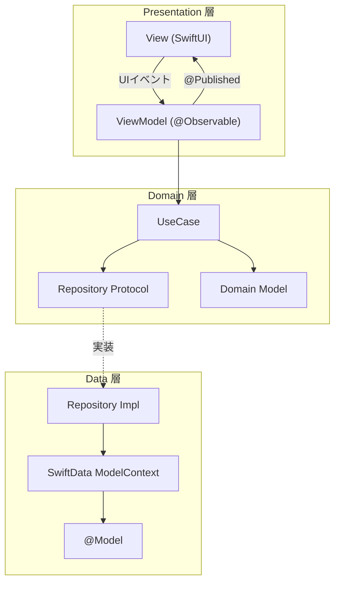

# アーキテクチャ設計書

## 1. 概要

エンジニア向け学習知識管理アプリ。ノウハウの記録・タグ分類・クイズ復習による知識定着を目的とする。

アーキテクチャは **Clean Architecture（3層）+ MVVM** を採用し、各レイヤーの責務を明確に分離する。

---

## 2. レイヤー構成図



### 依存ルール

- `Presentation` → `Domain` のみ参照可（`Data` は直接参照禁止）
- `Domain` → 他レイヤーへの参照禁止（純粋な Swift、iOS フレームワーク依存なし）
- `Data` → `Domain` の Repository Protocol を実装

---

## 3. 各レイヤーの責務

### Presentation 層（`Presentation/`）

| クラス | 責務 |
|---|---|
| `XxxView.swift` | SwiftUI による UI 描画 |
| `XxxViewModel.swift` | UIState を @Published で保持・更新、UseCase を呼び出す |

- ViewModel は `@Observable` クラスとして定義（iOS 17+）
- UI状態は `@Published var` として公開
- 画面ごとにサブフォルダ（`Home/`, `Edit/`, `Review/`, `Quiz/`, `Settings/`）

### Domain 層（`Domain/`）

| クラス | 責務 |
|---|---|
| `XxxUseCase.swift` | ビジネスロジックの単一責任（1ユースケース = 1クラス） |
| `XxxRepository.swift` | データアクセスの Protocol 定義 |
| `Xxx.swift`（Model） | アプリのドメインモデル（iOS フレームワーク依存なし） |

- 純粋 Swift のみ使用、テスタビリティが高い
- UseCase は async/await または AsyncStream を返す

### Data 層（`Data/`）

| クラス | 責務 |
|---|---|
| `XxxRepositoryImpl.swift` | Repository Protocol の実装 |
| `XxxModel.swift` | SwiftData の `@Model` スキーマ定義 |
| `AppDatabase.swift` | ModelContainer の設定・提供 |

- SwiftData の ModelContext を通じてデータを操作
- @Model → Domain Model の変換（マッピング）を Repository 実装内で行う

---

## 4. 採用パターン

### MVVM（Model-View-ViewModel）

```
View ←@Published← ViewModel ←UseCase← Repository
  ↓UIイベント↑
```

- `ViewModel` が画面の状態を `@Published` で保持
- `View` は状態変化を自動検知して再描画（SwiftUI の body 再評価）
- ユーザー操作は ViewModel のメソッド呼び出しとして伝達

### Repository パターン

- `Domain` 層が Repository Protocol を定義し、データソースを抽象化
- `Data` 層が実装を提供し、SwiftData / UserDefaults などの具体的な実装を隠蔽
- テスト時にモック実装と差し替え可能

### UseCase（Single Responsibility）

- 1つの UseCase は 1つのビジネスロジックのみ担当
- ViewModel が複数の UseCase を組み合わせて使用
- 命名規則: 動詞+名詞（例: `GetKnowhowListUseCase`, `SaveKnowhowUseCase`）

---

## 5. 主要フレームワーク・ライブラリと選定理由

| フレームワーク | 用途 | 選定理由 |
|---|---|---|
| SwiftUI | UI | Apple 公式の宣言的 UI フレームワーク。状態ベースの再描画で ViewModel との親和性が高い |
| SwiftData | ローカル DB | Core Data の後継。`@Model` マクロで型安全なスキーマ定義、SwiftUI との統合が容易 |
| NavigationStack / TabView | 画面遷移 | SwiftUI 標準のナビゲーション。型安全なルーティングが可能 |
| UNUserNotificationCenter | 通知 | iOS 標準のローカル通知 API。時刻指定トリガーによる通知スケジューリング |
| UserDefaults | 設定保存 | 軽量なキーバリューストア。通知設定などのシンプルな設定値の永続化に適する |

---

## 6. データフロー

### UIイベント → DB 書き込み

```
View(UIイベント)
  → ViewModel.onXxx()
    → XxxUseCase.execute()
      → KnowhowRepository.save()
        → KnowhowRepositoryImpl.save()
          → ModelContext.insert()
            → SwiftData
```

### DB → UI 反映

```
SwiftData
  → KnowhowRepositoryImpl.getAll() → [Knowhow]
    → GetKnowhowListUseCase → [Knowhow]
      → ViewModel.@Published knowhowList
        → View（自動再描画）
```

---

## 7. DI 構成方針（EnvironmentObject / 手動DI）

```swift
// App エントリーポイントで依存関係を組み立て
@main
struct BrainIndexApp: App {
    let container = ModelContainer(for: KnowhowModel.self)

    var body: some Scene {
        WindowGroup {
            let repository = KnowhowRepositoryImpl(modelContext: container.mainContext)
            let viewModel = HomeViewModel(
                getKnowhowListUseCase: GetKnowhowListUseCase(repository: repository)
            )
            ContentView()
                .environmentObject(viewModel)
        }
    }
}

// View での受け取り
struct HomeView: View {
    @EnvironmentObject var viewModel: HomeViewModel
}
```

- `ModelContainer` を App 起動時に1つ生成し全体で共有
- Repository は `ModelContext` を受け取るイニシャライザで初期化
- ViewModel はコンストラクタインジェクションで UseCase を受け取る
