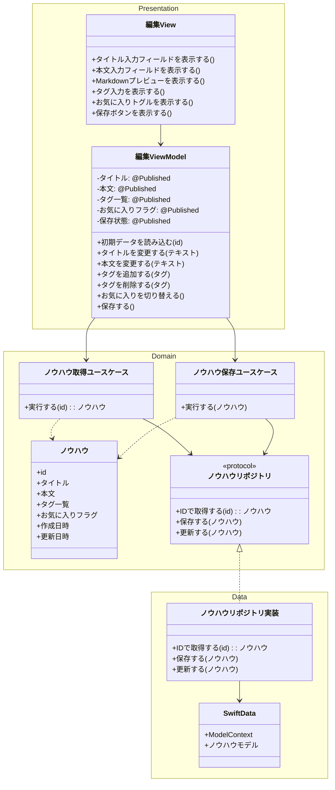

# 分析クラス図 - 編集View

編集View（新規作成・更新）のクリーンアーキテクチャに基づく概念レベルのクラス構成。

```mermaid
classDiagram
    namespace Presentation {
        class 編集View {
            +タイトル入力フィールドを表示する()
            +本文入力フィールドを表示する()
            +Markdownプレビューを表示する()
            +タグ入力を表示する()
            +お気に入りトグルを表示する()
            +保存ボタンを表示する()
        }
        class 編集ViewModel {
            -タイトル: @Published
            -本文: @Published
            -タグ一覧: @Published
            -お気に入りフラグ: @Published
            -保存状態: @Published
            +初期データを読み込む(id)
            +タイトルを変更する(テキスト)
            +本文を変更する(テキスト)
            +タグを追加する(タグ)
            +タグを削除する(タグ)
            +お気に入りを切り替える()
            +保存する()
        }
    }

    namespace Domain {
        class ノウハウ取得ユースケース {
            +実行する(id): ノウハウ
        }
        class ノウハウ保存ユースケース {
            +実行する(ノウハウ)
        }
        class ノウハウ {
            +id
            +タイトル
            +本文
            +タグ一覧
            +お気に入りフラグ
            +作成日時
            +更新日時
        }
        class ノウハウリポジトリ {
            <<protocol>>
            +IDで取得する(id): ノウハウ
            +保存する(ノウハウ)
            +更新する(ノウハウ)
        }
    }

    namespace Data {
        class ノウハウリポジトリ実装 {
            +IDで取得する(id): ノウハウ
            +保存する(ノウハウ)
            +更新する(ノウハウ)
        }
        class SwiftData {
            +ModelContext
            +ノウハウモデル
        }
    }

    編集View --> 編集ViewModel
    編集ViewModel --> ノウハウ取得ユースケース
    編集ViewModel --> ノウハウ保存ユースケース
    ノウハウ取得ユースケース --> ノウハウリポジトリ
    ノウハウ保存ユースケース --> ノウハウリポジトリ
    ノウハウリポジトリ <|.. ノウハウリポジトリ実装
    ノウハウリポジトリ実装 --> SwiftData
    ノウハウ取得ユースケース ..> ノウハウ
    ノウハウ保存ユースケース ..> ノウハウ
```
