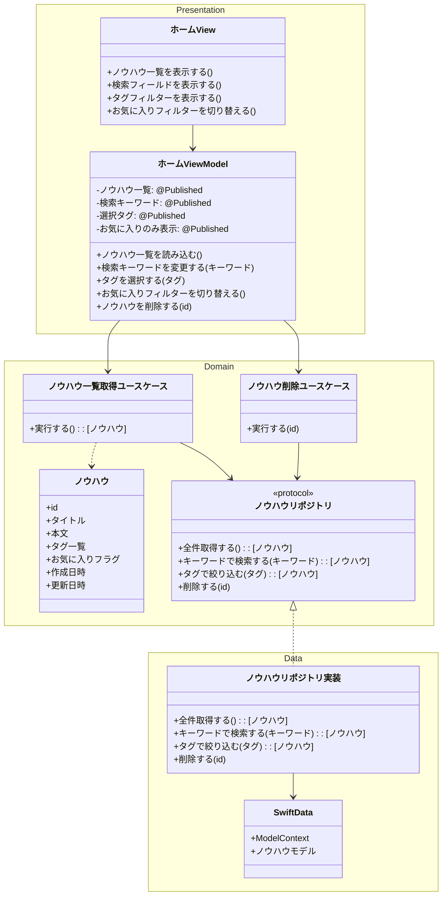

# 分析クラス図 - ホームView

ホームViewのクリーンアーキテクチャに基づく概念レベルのクラス構成。

```mermaid
classDiagram
    namespace Presentation {
        class ホームView {
            +ノウハウ一覧を表示する()
            +検索フィールドを表示する()
            +タグフィルターを表示する()
            +お気に入りフィルターを切り替える()
        }
        class ホームViewModel {
            -ノウハウ一覧: @Published
            -検索キーワード: @Published
            -選択タグ: @Published
            -お気に入りのみ表示: @Published
            +ノウハウ一覧を読み込む()
            +検索キーワードを変更する(キーワード)
            +タグを選択する(タグ)
            +お気に入りフィルターを切り替える()
            +ノウハウを削除する(id)
        }
    }

    namespace Domain {
        class ノウハウ一覧取得ユースケース {
            +実行する(): [ノウハウ]
        }
        class ノウハウ削除ユースケース {
            +実行する(id)
        }
        class ノウハウ {
            +id
            +タイトル
            +本文
            +タグ一覧
            +お気に入りフラグ
            +作成日時
            +更新日時
        }
        class ノウハウリポジトリ {
            <<protocol>>
            +全件取得する(): [ノウハウ]
            +キーワードで検索する(キーワード): [ノウハウ]
            +タグで絞り込む(タグ): [ノウハウ]
            +削除する(id)
        }
    }

    namespace Data {
        class ノウハウリポジトリ実装 {
            +全件取得する(): [ノウハウ]
            +キーワードで検索する(キーワード): [ノウハウ]
            +タグで絞り込む(タグ): [ノウハウ]
            +削除する(id)
        }
        class SwiftData {
            +ModelContext
            +ノウハウモデル
        }
    }

    ホームView --> ホームViewModel
    ホームViewModel --> ノウハウ一覧取得ユースケース
    ホームViewModel --> ノウハウ削除ユースケース
    ノウハウ一覧取得ユースケース --> ノウハウリポジトリ
    ノウハウ削除ユースケース --> ノウハウリポジトリ
    ノウハウリポジトリ <|.. ノウハウリポジトリ実装
    ノウハウリポジトリ実装 --> SwiftData
    ノウハウ一覧取得ユースケース ..> ノウハウ
```
