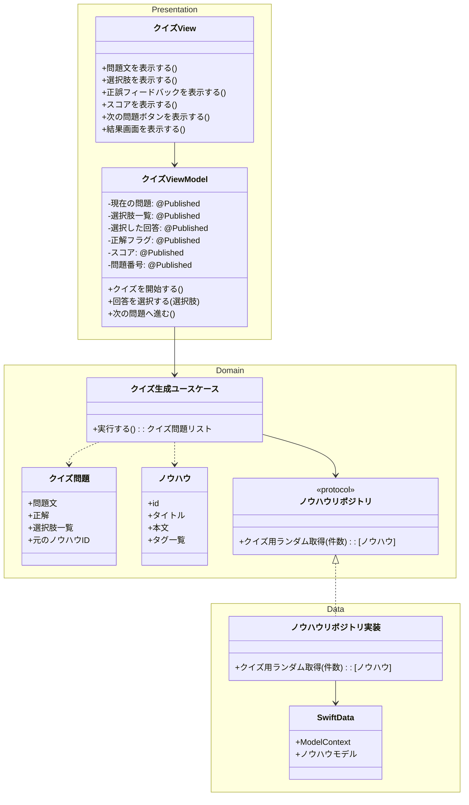

# 分析クラス図 - クイズView

クイズViewのクリーンアーキテクチャに基づく概念レベルのクラス構成。

```mermaid
classDiagram
    namespace Presentation {
        class クイズView {
            +問題文を表示する()
            +選択肢を表示する()
            +正誤フィードバックを表示する()
            +スコアを表示する()
            +次の問題ボタンを表示する()
            +結果画面を表示する()
        }
        class クイズViewModel {
            -現在の問題: @Published
            -選択肢一覧: @Published
            -選択した回答: @Published
            -正解フラグ: @Published
            -スコア: @Published
            -問題番号: @Published
            +クイズを開始する()
            +回答を選択する(選択肢)
            +次の問題へ進む()
        }
    }

    namespace Domain {
        class クイズ生成ユースケース {
            +実行する(): クイズ問題リスト
        }
        class クイズ問題 {
            +問題文
            +正解
            +選択肢一覧
            +元のノウハウID
        }
        class ノウハウ {
            +id
            +タイトル
            +本文
            +タグ一覧
        }
        class ノウハウリポジトリ {
            <<protocol>>
            +クイズ用ランダム取得(件数): [ノウハウ]
        }
    }

    namespace Data {
        class ノウハウリポジトリ実装 {
            +クイズ用ランダム取得(件数): [ノウハウ]
        }
        class SwiftData {
            +ModelContext
            +ノウハウモデル
        }
    }

    クイズView --> クイズViewModel
    クイズViewModel --> クイズ生成ユースケース
    クイズ生成ユースケース --> ノウハウリポジトリ
    クイズ生成ユースケース ..> クイズ問題
    クイズ生成ユースケース ..> ノウハウ
    ノウハウリポジトリ <|.. ノウハウリポジトリ実装
    ノウハウリポジトリ実装 --> SwiftData
```
