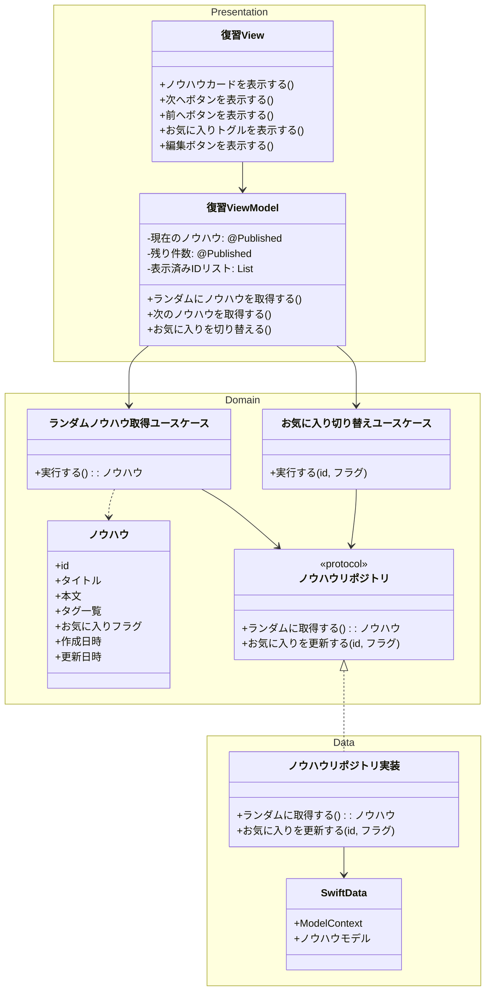

# 分析クラス図 - 復習View

復習Viewのクリーンアーキテクチャに基づく概念レベルのクラス構成。

```mermaid
classDiagram
    namespace Presentation {
        class 復習View {
            +ノウハウカードを表示する()
            +次へボタンを表示する()
            +前へボタンを表示する()
            +お気に入りトグルを表示する()
            +編集ボタンを表示する()
        }
        class 復習ViewModel {
            -現在のノウハウ: @Published
            -残り件数: @Published
            -表示済みIDリスト: List
            +ランダムにノウハウを取得する()
            +次のノウハウを取得する()
            +お気に入りを切り替える()
        }
    }

    namespace Domain {
        class ランダムノウハウ取得ユースケース {
            +実行する(): ノウハウ
        }
        class お気に入り切り替えユースケース {
            +実行する(id, フラグ)
        }
        class ノウハウ {
            +id
            +タイトル
            +本文
            +タグ一覧
            +お気に入りフラグ
            +作成日時
            +更新日時
        }
        class ノウハウリポジトリ {
            <<protocol>>
            +ランダムに取得する(): ノウハウ
            +お気に入りを更新する(id, フラグ)
        }
    }

    namespace Data {
        class ノウハウリポジトリ実装 {
            +ランダムに取得する(): ノウハウ
            +お気に入りを更新する(id, フラグ)
        }
        class SwiftData {
            +ModelContext
            +ノウハウモデル
        }
    }

    復習View --> 復習ViewModel
    復習ViewModel --> ランダムノウハウ取得ユースケース
    復習ViewModel --> お気に入り切り替えユースケース
    ランダムノウハウ取得ユースケース --> ノウハウリポジトリ
    お気に入り切り替えユースケース --> ノウハウリポジトリ
    ノウハウリポジトリ <|.. ノウハウリポジトリ実装
    ノウハウリポジトリ実装 --> SwiftData
    ランダムノウハウ取得ユースケース ..> ノウハウ
```
