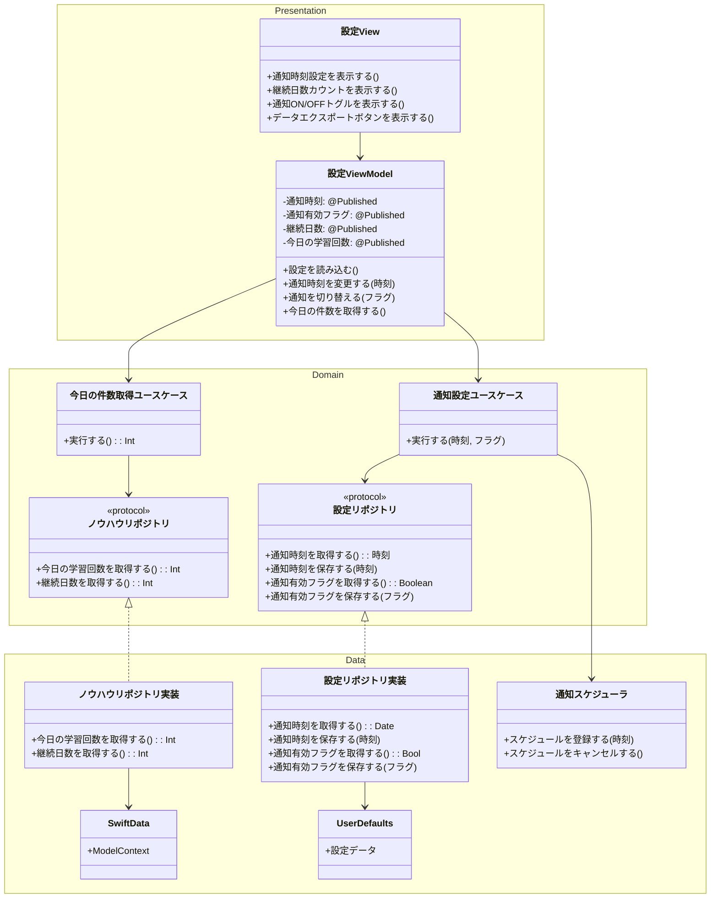

# 分析クラス図 - 設定View

設定Viewのクリーンアーキテクチャに基づく概念レベルのクラス構成。

```mermaid
classDiagram
    namespace Presentation {
        class 設定View {
            +通知時刻設定を表示する()
            +継続日数カウントを表示する()
            +通知ON/OFFトグルを表示する()
            +データエクスポートボタンを表示する()
        }
        class 設定ViewModel {
            -通知時刻: @Published
            -通知有効フラグ: @Published
            -継続日数: @Published
            -今日の学習回数: @Published
            +設定を読み込む()
            +通知時刻を変更する(時刻)
            +通知を切り替える(フラグ)
            +今日の件数を取得する()
        }
    }

    namespace Domain {
        class 今日の件数取得ユースケース {
            +実行する(): Int
        }
        class 通知設定ユースケース {
            +実行する(時刻, フラグ)
        }
        class 設定リポジトリ {
            <<protocol>>
            +通知時刻を取得する(): 時刻
            +通知時刻を保存する(時刻)
            +通知有効フラグを取得する(): Boolean
            +通知有効フラグを保存する(フラグ)
        }
        class ノウハウリポジトリ {
            <<protocol>>
            +今日の学習回数を取得する(): Int
            +継続日数を取得する(): Int
        }
    }

    namespace Data {
        class 設定リポジトリ実装 {
            +通知時刻を取得する(): Date
            +通知時刻を保存する(時刻)
            +通知有効フラグを取得する(): Bool
            +通知有効フラグを保存する(フラグ)
        }
        class ノウハウリポジトリ実装 {
            +今日の学習回数を取得する(): Int
            +継続日数を取得する(): Int
        }
        class UserDefaults {
            +設定データ
        }
        class SwiftData {
            +ModelContext
        }
        class 通知スケジューラ {
            +スケジュールを登録する(時刻)
            +スケジュールをキャンセルする()
        }
    }

    設定View --> 設定ViewModel
    設定ViewModel --> 今日の件数取得ユースケース
    設定ViewModel --> 通知設定ユースケース
    今日の件数取得ユースケース --> ノウハウリポジトリ
    通知設定ユースケース --> 設定リポジトリ
    通知設定ユースケース --> 通知スケジューラ
    設定リポジトリ <|.. 設定リポジトリ実装
    ノウハウリポジトリ <|.. ノウハウリポジトリ実装
    設定リポジトリ実装 --> UserDefaults
    ノウハウリポジトリ実装 --> SwiftData
```
