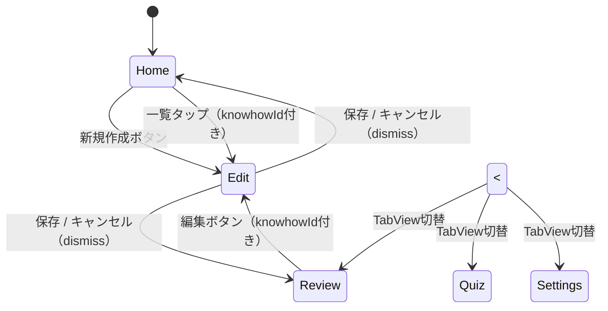

# 画面遷移設計書

## 1. 概要

SwiftUI の NavigationStack と TabView を使用した画面遷移管理。

- **TabView**: Home / Review / Quiz / Settings の4タブ
- **NavigationStack**: 各タブ内のスタックナビゲーション（Edit 画面への遷移など）

## 2. 画面一覧

| 画面 | 引数 | 役割 |
|---|---|---|
| HomeView | なし | ノウハウ一覧・新規作成への導線 |
| EditView | `knowhowId: UUID?`（省略可） | 新規作成・既存編集 |
| ReviewView | なし | ランダム復習 |
| QuizView | なし | クイズ形式の理解度確認 |
| SettingsView | なし | 通知・アプリ設定 |

## 3. 画面遷移図



## 4. TabView 構成

| タブ | SF Symbol | 役割 |
|---|---|---|
| Home | `house` | ノウハウ一覧 |
| Review | `arrow.clockwise` | ランダム復習 |
| Quiz | `questionmark.circle` | クイズ |
| Settings | `gearshape` | 設定 |

- 各タブは独立した NavigationStack を持つ
- Edit は TabView に含めず、sheet または NavigationLink で遷移

## 5. ナビゲーション管理方針

| 操作 | 挙動 |
|---|---|
| Edit 保存後 | `dismiss()` で遷移元（Home or Review）に戻る |
| Edit キャンセル | `dismiss()` で遷移元に戻る |
| TabView タブ切替 | SwiftUI が自動でスタック状態を保持 |
| 起動時の表示 | Home タブ固定 |

## 6. SwiftUI 実装ガイドライン

### TabView 構成

```swift
struct ContentView: View {
    var body: some View {
        TabView {
            NavigationStack {
                HomeView()
            }
            .tabItem {
                Label("ホーム", systemImage: "house")
            }

            NavigationStack {
                ReviewView()
            }
            .tabItem {
                Label("復習", systemImage: "arrow.clockwise")
            }

            NavigationStack {
                QuizView()
            }
            .tabItem {
                Label("クイズ", systemImage: "questionmark.circle")
            }

            NavigationStack {
                SettingsView()
            }
            .tabItem {
                Label("設定", systemImage: "gearshape")
            }
        }
    }
}
```

### Edit 画面への遷移（sheet）

```swift
// 新規作成
.sheet(isPresented: $showEditView) {
    EditView(knowhowId: nil)
}

// 既存編集
.sheet(item: $selectedKnowhow) { knowhow in
    EditView(knowhowId: knowhow.id)
}
```

### Edit 画面での dismiss

```swift
struct EditView: View {
    @Environment(\.dismiss) private var dismiss

    var body: some View {
        Button("保存") {
            viewModel.onSave()
            dismiss()
        }
    }
}
```
