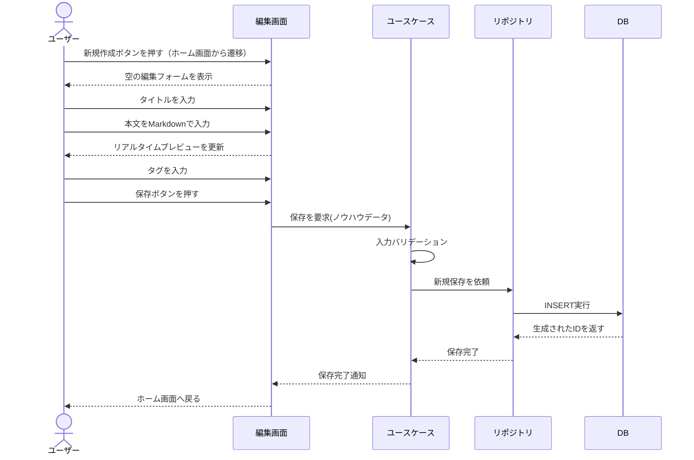
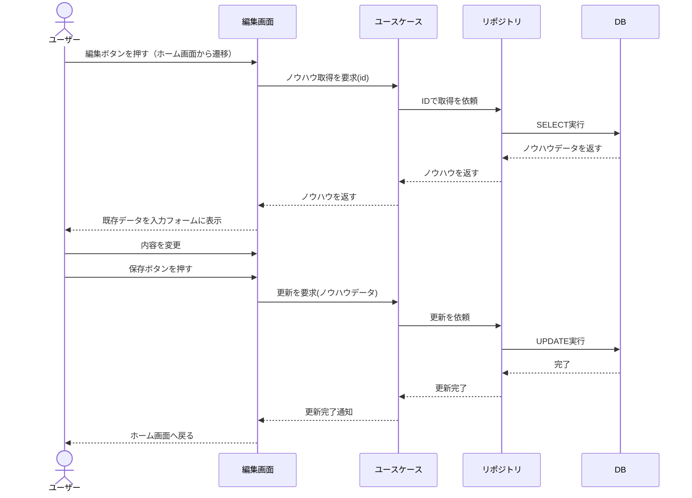

# 分析シーケンス図 - 編集画面

編集画面（新規作成・更新）におけるユーザー操作からDB保存までの概念的なフロー。

## 新規ノウハウ作成

```mermaid
sequenceDiagram
    actor ユーザー
    participant UI as 編集画面
    participant UC as ユースケース
    participant REP as リポジトリ
    participant DB

    ユーザー->>UI: 新規作成ボタンを押す（ホーム画面から遷移）
    UI-->>ユーザー: 空の編集フォームを表示
    ユーザー->>UI: タイトルを入力
    ユーザー->>UI: 本文をMarkdownで入力
    UI-->>ユーザー: リアルタイムプレビューを更新
    ユーザー->>UI: タグを入力
    ユーザー->>UI: 保存ボタンを押す
    UI->>UC: 保存を要求(ノウハウデータ)
    UC->>UC: 入力バリデーション
    UC->>REP: 新規保存を依頼
    REP->>DB: INSERT実行
    DB-->>REP: 生成されたIDを返す
    REP-->>UC: 保存完了
    UC-->>UI: 保存完了通知
    UI-->>ユーザー: ホーム画面へ戻る
```

## 既存ノウハウ編集

```mermaid
sequenceDiagram
    actor ユーザー
    participant UI as 編集画面
    participant UC as ユースケース
    participant REP as リポジトリ
    participant DB

    ユーザー->>UI: 編集ボタンを押す（ホーム画面から遷移）
    UI->>UC: ノウハウ取得を要求(id)
    UC->>REP: IDで取得を依頼
    REP->>DB: SELECT実行
    DB-->>REP: ノウハウデータを返す
    REP-->>UC: ノウハウを返す
    UC-->>UI: ノウハウを返す
    UI-->>ユーザー: 既存データを入力フォームに表示
    ユーザー->>UI: 内容を変更
    ユーザー->>UI: 保存ボタンを押す
    UI->>UC: 更新を要求(ノウハウデータ)
    UC->>REP: 更新を依頼
    REP->>DB: UPDATE実行
    DB-->>REP: 完了
    REP-->>UC: 更新完了
    UC-->>UI: 更新完了通知
    UI-->>ユーザー: ホーム画面へ戻る
```
