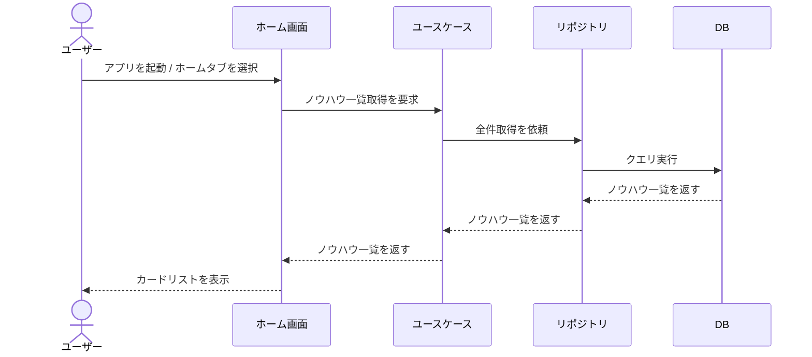
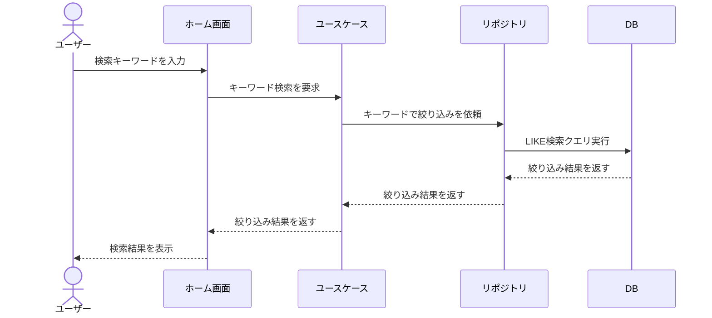
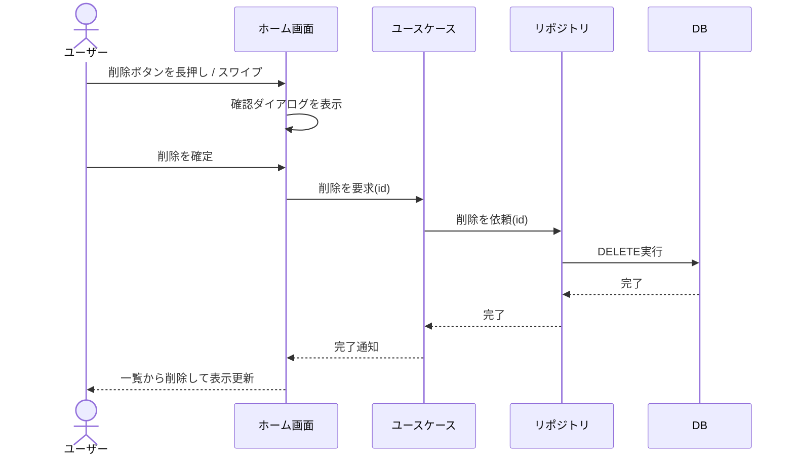

# 分析シーケンス図 - ホーム画面

ホーム画面におけるユーザー操作からDB参照までの概念的なフロー。

## ノウハウ一覧表示

```mermaid
sequenceDiagram
    actor ユーザー
    participant UI as ホーム画面
    participant UC as ユースケース
    participant REP as リポジトリ
    participant DB

    ユーザー->>UI: アプリを起動 / ホームタブを選択
    UI->>UC: ノウハウ一覧取得を要求
    UC->>REP: 全件取得を依頼
    REP->>DB: クエリ実行
    DB-->>REP: ノウハウ一覧を返す
    REP-->>UC: ノウハウ一覧を返す
    UC-->>UI: ノウハウ一覧を返す
    UI-->>ユーザー: カードリストを表示
```

## キーワード検索

```mermaid
sequenceDiagram
    actor ユーザー
    participant UI as ホーム画面
    participant UC as ユースケース
    participant REP as リポジトリ
    participant DB

    ユーザー->>UI: 検索キーワードを入力
    UI->>UC: キーワード検索を要求
    UC->>REP: キーワードで絞り込みを依頼
    REP->>DB: LIKE検索クエリ実行
    DB-->>REP: 絞り込み結果を返す
    REP-->>UC: 絞り込み結果を返す
    UC-->>UI: 絞り込み結果を返す
    UI-->>ユーザー: 検索結果を表示
```

## ノウハウ削除

```mermaid
sequenceDiagram
    actor ユーザー
    participant UI as ホーム画面
    participant UC as ユースケース
    participant REP as リポジトリ
    participant DB

    ユーザー->>UI: 削除ボタンを長押し / スワイプ
    UI->>UI: 確認ダイアログを表示
    ユーザー->>UI: 削除を確定
    UI->>UC: 削除を要求(id)
    UC->>REP: 削除を依頼(id)
    REP->>DB: DELETE実行
    DB-->>REP: 完了
    REP-->>UC: 完了
    UC-->>UI: 完了通知
    UI-->>ユーザー: 一覧から削除して表示更新
```
