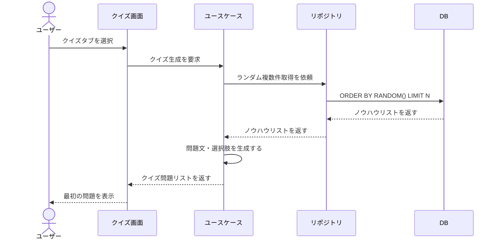
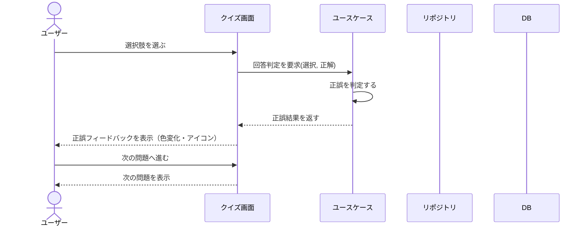
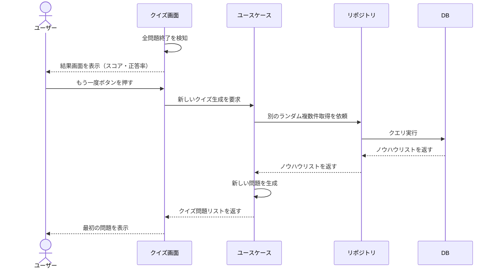

# 分析シーケンス図 - クイズ画面

クイズ画面におけるユーザー操作からDB参照・問題生成までの概念的なフロー。

## クイズ開始・問題表示

```mermaid
sequenceDiagram
    actor ユーザー
    participant UI as クイズ画面
    participant UC as ユースケース
    participant REP as リポジトリ
    participant DB

    ユーザー->>UI: クイズタブを選択
    UI->>UC: クイズ生成を要求
    UC->>REP: ランダム複数件取得を依頼
    REP->>DB: ORDER BY RANDOM() LIMIT N
    DB-->>REP: ノウハウリストを返す
    REP-->>UC: ノウハウリストを返す
    UC->>UC: 問題文・選択肢を生成する
    UC-->>UI: クイズ問題リストを返す
    UI-->>ユーザー: 最初の問題を表示
```

## 回答・フィードバック

```mermaid
sequenceDiagram
    actor ユーザー
    participant UI as クイズ画面
    participant UC as ユースケース
    participant REP as リポジトリ
    participant DB

    ユーザー->>UI: 選択肢を選ぶ
    UI->>UC: 回答判定を要求(選択, 正解)
    UC->>UC: 正誤を判定する
    UC-->>UI: 正誤結果を返す
    UI-->>ユーザー: 正誤フィードバックを表示（色変化・アイコン）
    ユーザー->>UI: 次の問題へ進む
    UI-->>ユーザー: 次の問題を表示
```

## クイズ終了・結果表示

```mermaid
sequenceDiagram
    actor ユーザー
    participant UI as クイズ画面
    participant UC as ユースケース
    participant REP as リポジトリ
    participant DB

    UI->>UI: 全問題終了を検知
    UI-->>ユーザー: 結果画面を表示（スコア・正答率）
    ユーザー->>UI: もう一度ボタンを押す
    UI->>UC: 新しいクイズ生成を要求
    UC->>REP: 別のランダム複数件取得を依頼
    REP->>DB: クエリ実行
    DB-->>REP: ノウハウリストを返す
    REP-->>UC: ノウハウリストを返す
    UC->>UC: 新しい問題を生成
    UC-->>UI: クイズ問題リストを返す
    UI-->>ユーザー: 最初の問題を表示
```
