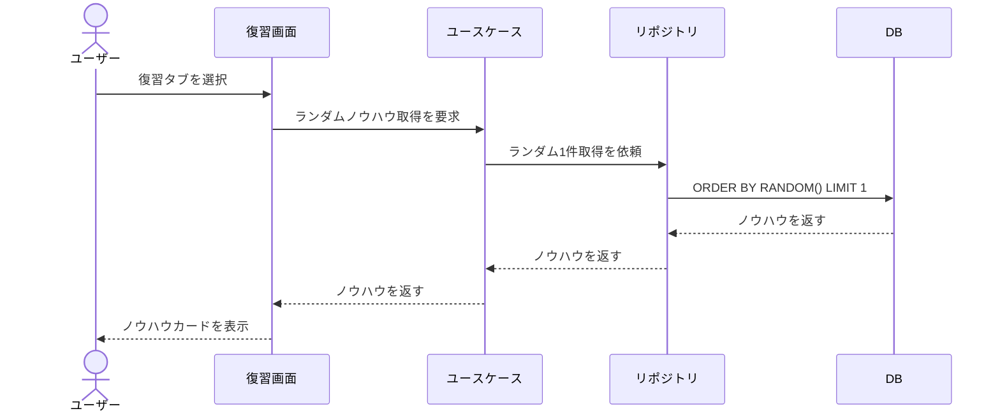
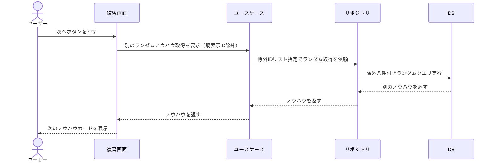
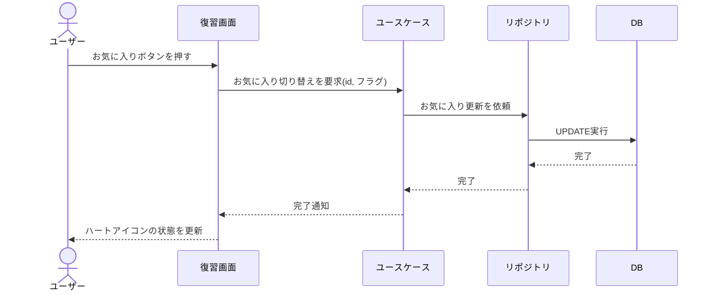

# 分析シーケンス図 - 復習画面

復習画面におけるユーザー操作からDB参照までの概念的なフロー。

## ランダム復習

```mermaid
sequenceDiagram
    actor ユーザー
    participant UI as 復習画面
    participant UC as ユースケース
    participant REP as リポジトリ
    participant DB

    ユーザー->>UI: 復習タブを選択
    UI->>UC: ランダムノウハウ取得を要求
    UC->>REP: ランダム1件取得を依頼
    REP->>DB: ORDER BY RANDOM() LIMIT 1
    DB-->>REP: ノウハウを返す
    REP-->>UC: ノウハウを返す
    UC-->>UI: ノウハウを返す
    UI-->>ユーザー: ノウハウカードを表示
```

## 次のノウハウへ進む

```mermaid
sequenceDiagram
    actor ユーザー
    participant UI as 復習画面
    participant UC as ユースケース
    participant REP as リポジトリ
    participant DB

    ユーザー->>UI: 次へボタンを押す
    UI->>UC: 別のランダムノウハウ取得を要求（既表示ID除外）
    UC->>REP: 除外IDリスト指定でランダム取得を依頼
    REP->>DB: 除外条件付きランダムクエリ実行
    DB-->>REP: 別のノウハウを返す
    REP-->>UC: ノウハウを返す
    UC-->>UI: ノウハウを返す
    UI-->>ユーザー: 次のノウハウカードを表示
```

## お気に入り切り替え

```mermaid
sequenceDiagram
    actor ユーザー
    participant UI as 復習画面
    participant UC as ユースケース
    participant REP as リポジトリ
    participant DB

    ユーザー->>UI: お気に入りボタンを押す
    UI->>UC: お気に入り切り替えを要求(id, フラグ)
    UC->>REP: お気に入り更新を依頼
    REP->>DB: UPDATE実行
    DB-->>REP: 完了
    REP-->>UC: 完了
    UC-->>UI: 完了通知
    UI-->>ユーザー: ハートアイコンの状態を更新
```
