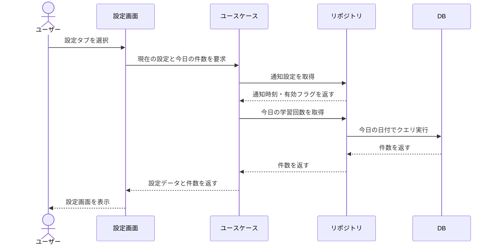
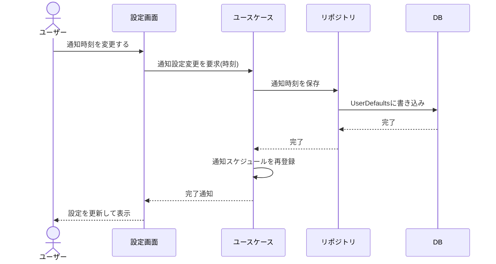
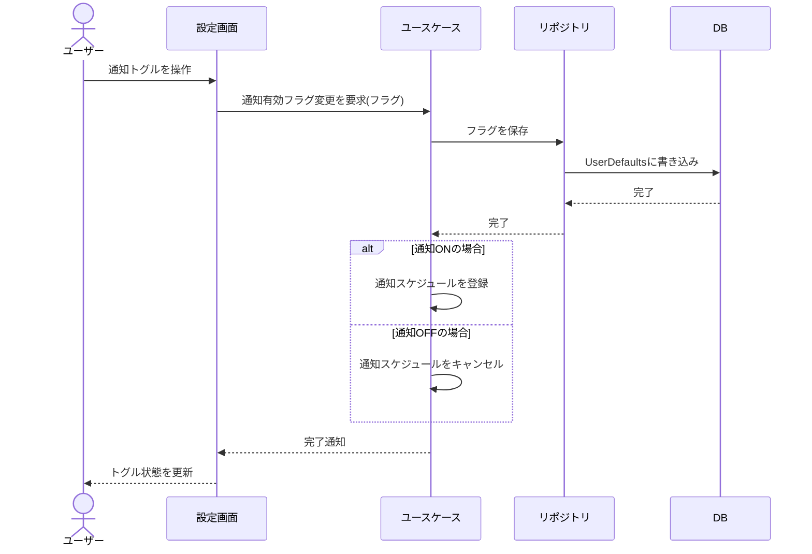

# 分析シーケンス図 - 設定画面

設定画面におけるユーザー操作からデータ保存・通知スケジュールまでの概念的なフロー。

## 設定画面表示

```mermaid
sequenceDiagram
    actor ユーザー
    participant UI as 設定画面
    participant UC as ユースケース
    participant REP as リポジトリ
    participant DB

    ユーザー->>UI: 設定タブを選択
    UI->>UC: 現在の設定と今日の件数を要求
    UC->>REP: 通知設定を取得
    REP-->>UC: 通知時刻・有効フラグを返す
    UC->>REP: 今日の学習回数を取得
    REP->>DB: 今日の日付でクエリ実行
    DB-->>REP: 件数を返す
    REP-->>UC: 件数を返す
    UC-->>UI: 設定データと件数を返す
    UI-->>ユーザー: 設定画面を表示
```

## 通知時刻変更

```mermaid
sequenceDiagram
    actor ユーザー
    participant UI as 設定画面
    participant UC as ユースケース
    participant REP as リポジトリ
    participant DB

    ユーザー->>UI: 通知時刻を変更する
    UI->>UC: 通知設定変更を要求(時刻)
    UC->>REP: 通知時刻を保存
    REP->>DB: UserDefaultsに書き込み
    DB-->>REP: 完了
    REP-->>UC: 完了
    UC->>UC: 通知スケジュールを再登録
    UC-->>UI: 完了通知
    UI-->>ユーザー: 設定を更新して表示
```

## 通知ON/OFF切り替え

```mermaid
sequenceDiagram
    actor ユーザー
    participant UI as 設定画面
    participant UC as ユースケース
    participant REP as リポジトリ
    participant DB

    ユーザー->>UI: 通知トグルを操作
    UI->>UC: 通知有効フラグ変更を要求(フラグ)
    UC->>REP: フラグを保存
    REP->>DB: UserDefaultsに書き込み
    DB-->>REP: 完了
    REP-->>UC: 完了
    alt 通知ONの場合
        UC->>UC: 通知スケジュールを登録
    else 通知OFFの場合
        UC->>UC: 通知スケジュールをキャンセル
    end
    UC-->>UI: 完了通知
    UI-->>ユーザー: トグル状態を更新
```
