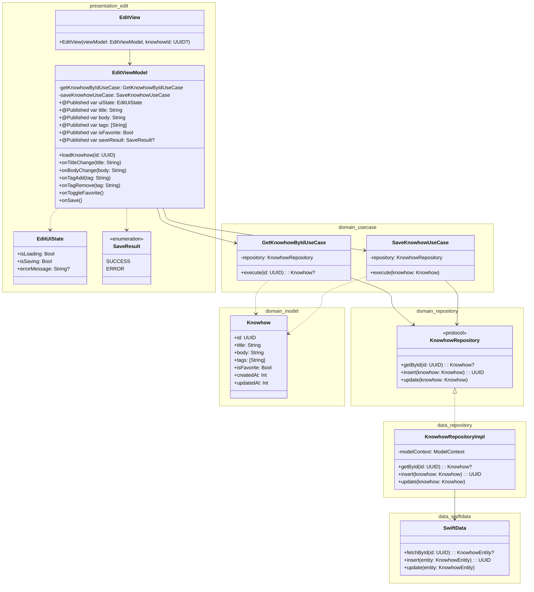

# 設計クラス図 - 編集画面

編集画面の実装クラス名・メソッド名を使った設計レベルのクラス図。

```mermaid
classDiagram
    namespace presentation_edit {
        class EditView {
            +EditView(viewModel: EditViewModel, knowhowId: UUID?)
        }
        class EditViewModel {
            -getKnowhowByIdUseCase: GetKnowhowByIdUseCase
            -saveKnowhowUseCase: SaveKnowhowUseCase
            +@Published var uiState: EditUiState
            +@Published var title: String
            +@Published var body: String
            +@Published var tags: [String]
            +@Published var isFavorite: Bool
            +@Published var saveResult: SaveResult?
            +loadKnowhow(id: UUID)
            +onTitleChange(title: String)
            +onBodyChange(body: String)
            +onTagAdd(tag: String)
            +onTagRemove(tag: String)
            +onToggleFavorite()
            +onSave()
        }
        class EditUiState {
            +isLoading: Bool
            +isSaving: Bool
            +errorMessage: String?
        }
        class SaveResult {
            <<enumeration>>
            SUCCESS
            ERROR
        }
    }

    namespace domain_usecase {
        class GetKnowhowByIdUseCase {
            -repository: KnowhowRepository
            +execute(id: UUID): Knowhow?
        }
        class SaveKnowhowUseCase {
            -repository: KnowhowRepository
            +execute(knowhow: Knowhow)
        }
    }

    namespace domain_model {
        class Knowhow {
            +id: UUID
            +title: String
            +body: String
            +tags: [String]
            +isFavorite: Bool
            +createdAt: Int
            +updatedAt: Int
        }
    }

    namespace domain_repository {
        class KnowhowRepository {
            <<protocol>>
            +getById(id: UUID): Knowhow?
            +insert(knowhow: Knowhow): UUID
            +update(knowhow: Knowhow)
        }
    }

    namespace data_repository {
        class KnowhowRepositoryImpl {
            -modelContext: ModelContext
            +getById(id: UUID): Knowhow?
            +insert(knowhow: Knowhow): UUID
            +update(knowhow: Knowhow)
        }
    }

    namespace data_swiftdata {
        class SwiftData {
            +fetchById(id: UUID): KnowhowEntity?
            +insert(entity: KnowhowEntity): UUID
            +update(entity: KnowhowEntity)
        }
    }

    EditView --> EditViewModel
    EditViewModel --> GetKnowhowByIdUseCase
    EditViewModel --> SaveKnowhowUseCase
    EditViewModel ..> EditUiState
    EditViewModel ..> SaveResult
    GetKnowhowByIdUseCase --> KnowhowRepository
    SaveKnowhowUseCase --> KnowhowRepository
    KnowhowRepository <|.. KnowhowRepositoryImpl
    KnowhowRepositoryImpl --> SwiftData
    GetKnowhowByIdUseCase ..> Knowhow
    SaveKnowhowUseCase ..> Knowhow
```
