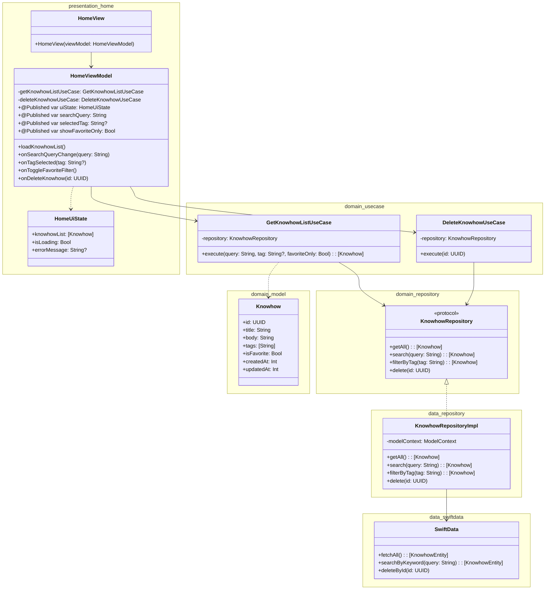

# 設計クラス図 - ホーム画面

ホーム画面の実装クラス名・メソッド名を使った設計レベルのクラス図。

```mermaid
classDiagram
    namespace presentation_home {
        class HomeView {
            +HomeView(viewModel: HomeViewModel)
        }
        class HomeViewModel {
            -getKnowhowListUseCase: GetKnowhowListUseCase
            -deleteKnowhowUseCase: DeleteKnowhowUseCase
            +@Published var uiState: HomeUiState
            +@Published var searchQuery: String
            +@Published var selectedTag: String?
            +@Published var showFavoriteOnly: Bool
            +loadKnowhowList()
            +onSearchQueryChange(query: String)
            +onTagSelected(tag: String?)
            +onToggleFavoriteFilter()
            +onDeleteKnowhow(id: UUID)
        }
        class HomeUiState {
            +knowhowList: [Knowhow]
            +isLoading: Bool
            +errorMessage: String?
        }
    }

    namespace domain_usecase {
        class GetKnowhowListUseCase {
            -repository: KnowhowRepository
            +execute(query: String, tag: String?, favoriteOnly: Bool): [Knowhow]
        }
        class DeleteKnowhowUseCase {
            -repository: KnowhowRepository
            +execute(id: UUID)
        }
    }

    namespace domain_model {
        class Knowhow {
            +id: UUID
            +title: String
            +body: String
            +tags: [String]
            +isFavorite: Bool
            +createdAt: Int
            +updatedAt: Int
        }
    }

    namespace domain_repository {
        class KnowhowRepository {
            <<protocol>>
            +getAll(): [Knowhow]
            +search(query: String): [Knowhow]
            +filterByTag(tag: String): [Knowhow]
            +delete(id: UUID)
        }
    }

    namespace data_repository {
        class KnowhowRepositoryImpl {
            -modelContext: ModelContext
            +getAll(): [Knowhow]
            +search(query: String): [Knowhow]
            +filterByTag(tag: String): [Knowhow]
            +delete(id: UUID)
        }
    }

    namespace data_swiftdata {
        class SwiftData {
            +fetchAll(): [KnowhowEntity]
            +searchByKeyword(query: String): [KnowhowEntity]
            +deleteById(id: UUID)
        }
    }

    HomeView --> HomeViewModel
    HomeViewModel --> GetKnowhowListUseCase
    HomeViewModel --> DeleteKnowhowUseCase
    HomeViewModel ..> HomeUiState
    GetKnowhowListUseCase --> KnowhowRepository
    DeleteKnowhowUseCase --> KnowhowRepository
    KnowhowRepository <|.. KnowhowRepositoryImpl
    KnowhowRepositoryImpl --> SwiftData
    GetKnowhowListUseCase ..> Knowhow
```
