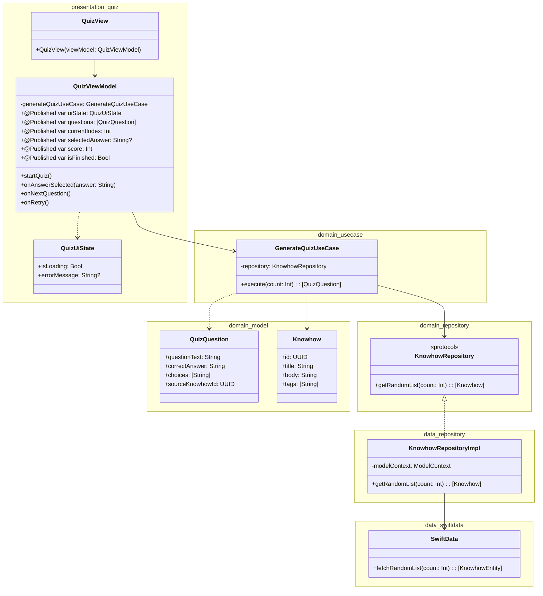

# 設計クラス図 - クイズ画面

クイズ画面の実装クラス名・メソッド名を使った設計レベルのクラス図。

```mermaid
classDiagram
    namespace presentation_quiz {
        class QuizView {
            +QuizView(viewModel: QuizViewModel)
        }
        class QuizViewModel {
            -generateQuizUseCase: GenerateQuizUseCase
            +@Published var uiState: QuizUiState
            +@Published var questions: [QuizQuestion]
            +@Published var currentIndex: Int
            +@Published var selectedAnswer: String?
            +@Published var score: Int
            +@Published var isFinished: Bool
            +startQuiz()
            +onAnswerSelected(answer: String)
            +onNextQuestion()
            +onRetry()
        }
        class QuizUiState {
            +isLoading: Bool
            +errorMessage: String?
        }
    }

    namespace domain_usecase {
        class GenerateQuizUseCase {
            -repository: KnowhowRepository
            +execute(count: Int): [QuizQuestion]
        }
    }

    namespace domain_model {
        class QuizQuestion {
            +questionText: String
            +correctAnswer: String
            +choices: [String]
            +sourceKnowhowId: UUID
        }
        class Knowhow {
            +id: UUID
            +title: String
            +body: String
            +tags: [String]
        }
    }

    namespace domain_repository {
        class KnowhowRepository {
            <<protocol>>
            +getRandomList(count: Int): [Knowhow]
        }
    }

    namespace data_repository {
        class KnowhowRepositoryImpl {
            -modelContext: ModelContext
            +getRandomList(count: Int): [Knowhow]
        }
    }

    namespace data_swiftdata {
        class SwiftData {
            +fetchRandomList(count: Int): [KnowhowEntity]
        }
    }

    QuizView --> QuizViewModel
    QuizViewModel --> GenerateQuizUseCase
    QuizViewModel ..> QuizUiState
    GenerateQuizUseCase --> KnowhowRepository
    GenerateQuizUseCase ..> QuizQuestion
    GenerateQuizUseCase ..> Knowhow
    KnowhowRepository <|.. KnowhowRepositoryImpl
    KnowhowRepositoryImpl --> SwiftData
```
