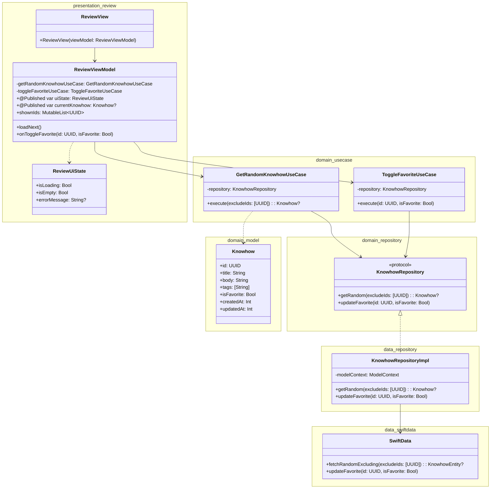

# 設計クラス図 - 復習画面

復習画面の実装クラス名・メソッド名を使った設計レベルのクラス図。

```mermaid
classDiagram
    namespace presentation_review {
        class ReviewView {
            +ReviewView(viewModel: ReviewViewModel)
        }
        class ReviewViewModel {
            -getRandomKnowhowUseCase: GetRandomKnowhowUseCase
            -toggleFavoriteUseCase: ToggleFavoriteUseCase
            +@Published var uiState: ReviewUiState
            +@Published var currentKnowhow: Knowhow?
            +shownIds: MutableList~UUID~
            +loadNext()
            +onToggleFavorite(id: UUID, isFavorite: Bool)
        }
        class ReviewUiState {
            +isLoading: Bool
            +isEmpty: Bool
            +errorMessage: String?
        }
    }

    namespace domain_usecase {
        class GetRandomKnowhowUseCase {
            -repository: KnowhowRepository
            +execute(excludeIds: [UUID]): Knowhow?
        }
        class ToggleFavoriteUseCase {
            -repository: KnowhowRepository
            +execute(id: UUID, isFavorite: Bool)
        }
    }

    namespace domain_model {
        class Knowhow {
            +id: UUID
            +title: String
            +body: String
            +tags: [String]
            +isFavorite: Bool
            +createdAt: Int
            +updatedAt: Int
        }
    }

    namespace domain_repository {
        class KnowhowRepository {
            <<protocol>>
            +getRandom(excludeIds: [UUID]): Knowhow?
            +updateFavorite(id: UUID, isFavorite: Bool)
        }
    }

    namespace data_repository {
        class KnowhowRepositoryImpl {
            -modelContext: ModelContext
            +getRandom(excludeIds: [UUID]): Knowhow?
            +updateFavorite(id: UUID, isFavorite: Bool)
        }
    }

    namespace data_swiftdata {
        class SwiftData {
            +fetchRandomExcluding(excludeIds: [UUID]): KnowhowEntity?
            +updateFavorite(id: UUID, isFavorite: Bool)
        }
    }

    ReviewView --> ReviewViewModel
    ReviewViewModel --> GetRandomKnowhowUseCase
    ReviewViewModel --> ToggleFavoriteUseCase
    ReviewViewModel ..> ReviewUiState
    GetRandomKnowhowUseCase --> KnowhowRepository
    ToggleFavoriteUseCase --> KnowhowRepository
    KnowhowRepository <|.. KnowhowRepositoryImpl
    KnowhowRepositoryImpl --> SwiftData
    GetRandomKnowhowUseCase ..> Knowhow
```
