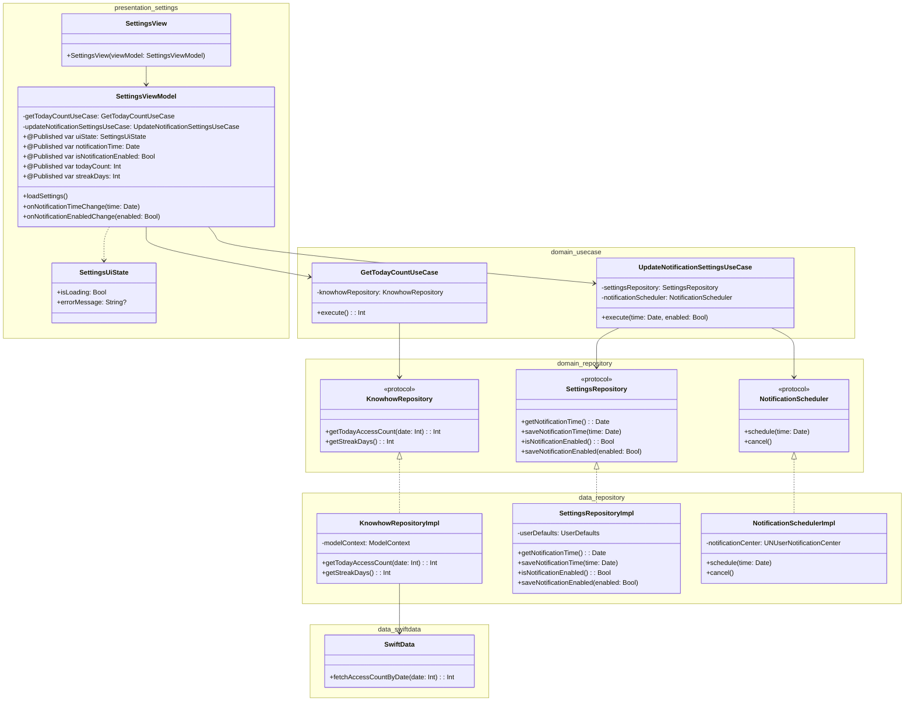

# 設計クラス図 - 設定画面

設定画面の実装クラス名・メソッド名を使った設計レベルのクラス図。

```mermaid
classDiagram
    namespace presentation_settings {
        class SettingsView {
            +SettingsView(viewModel: SettingsViewModel)
        }
        class SettingsViewModel {
            -getTodayCountUseCase: GetTodayCountUseCase
            -updateNotificationSettingsUseCase: UpdateNotificationSettingsUseCase
            +@Published var uiState: SettingsUiState
            +@Published var notificationTime: Date
            +@Published var isNotificationEnabled: Bool
            +@Published var todayCount: Int
            +@Published var streakDays: Int
            +loadSettings()
            +onNotificationTimeChange(time: Date)
            +onNotificationEnabledChange(enabled: Bool)
        }
        class SettingsUiState {
            +isLoading: Bool
            +errorMessage: String?
        }
    }

    namespace domain_usecase {
        class GetTodayCountUseCase {
            -knowhowRepository: KnowhowRepository
            +execute(): Int
        }
        class UpdateNotificationSettingsUseCase {
            -settingsRepository: SettingsRepository
            -notificationScheduler: NotificationScheduler
            +execute(time: Date, enabled: Bool)
        }
    }

    namespace domain_repository {
        class KnowhowRepository {
            <<protocol>>
            +getTodayAccessCount(date: Int): Int
            +getStreakDays(): Int
        }
        class SettingsRepository {
            <<protocol>>
            +getNotificationTime(): Date
            +saveNotificationTime(time: Date)
            +isNotificationEnabled(): Bool
            +saveNotificationEnabled(enabled: Bool)
        }
        class NotificationScheduler {
            <<protocol>>
            +schedule(time: Date)
            +cancel()
        }
    }

    namespace data_repository {
        class KnowhowRepositoryImpl {
            -modelContext: ModelContext
            +getTodayAccessCount(date: Int): Int
            +getStreakDays(): Int
        }
        class SettingsRepositoryImpl {
            -userDefaults: UserDefaults
            +getNotificationTime(): Date
            +saveNotificationTime(time: Date)
            +isNotificationEnabled(): Bool
            +saveNotificationEnabled(enabled: Bool)
        }
        class NotificationSchedulerImpl {
            -notificationCenter: UNUserNotificationCenter
            +schedule(time: Date)
            +cancel()
        }
    }

    namespace data_swiftdata {
        class SwiftData {
            +fetchAccessCountByDate(date: Int): Int
        }
    }

    SettingsView --> SettingsViewModel
    SettingsViewModel --> GetTodayCountUseCase
    SettingsViewModel --> UpdateNotificationSettingsUseCase
    SettingsViewModel ..> SettingsUiState
    GetTodayCountUseCase --> KnowhowRepository
    UpdateNotificationSettingsUseCase --> SettingsRepository
    UpdateNotificationSettingsUseCase --> NotificationScheduler
    KnowhowRepository <|.. KnowhowRepositoryImpl
    SettingsRepository <|.. SettingsRepositoryImpl
    NotificationScheduler <|.. NotificationSchedulerImpl
    KnowhowRepositoryImpl --> SwiftData
```
