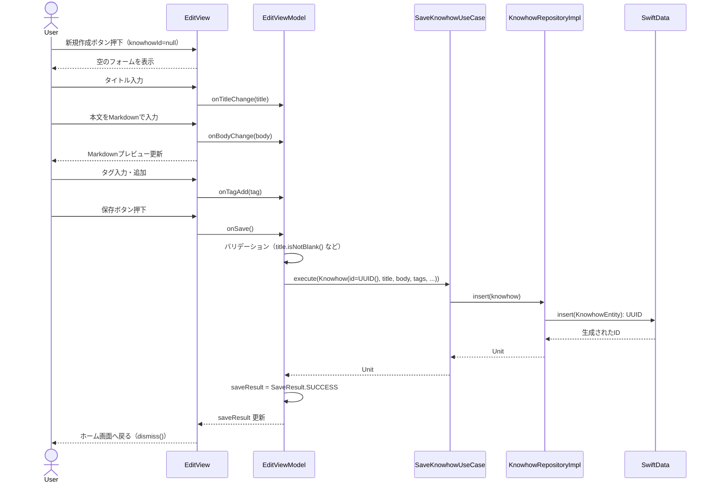
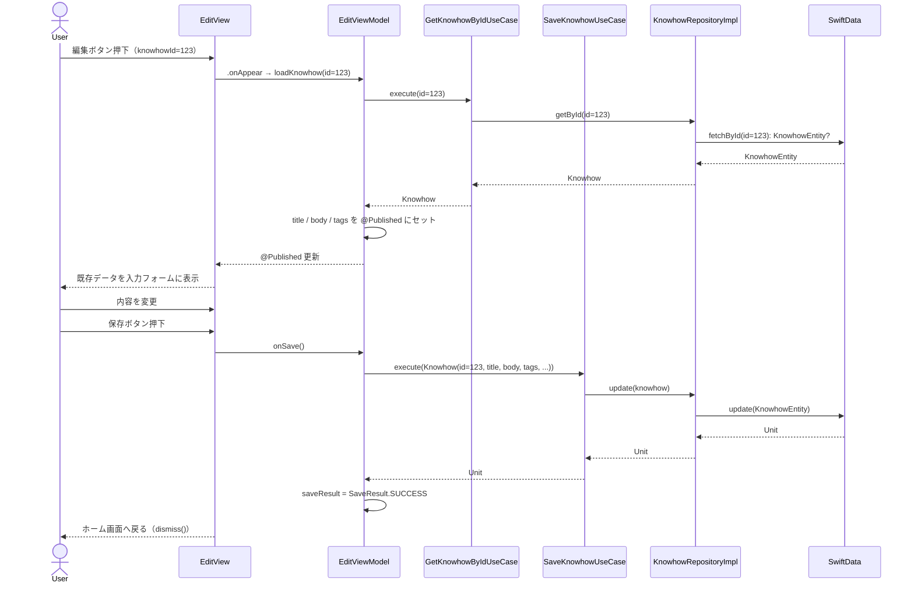

# 設計シーケンス図 - 編集画面

編集画面の実装クラス名・メソッド名を使ったシーケンス図。

## 新規ノウハウ作成

```mermaid
sequenceDiagram
    actor User
    participant EditView
    participant EditViewModel
    participant SaveKnowhowUseCase
    participant KnowhowRepositoryImpl
    participant SwiftData

    User->>EditView: 新規作成ボタン押下（knowhowId=null）
    EditView-->>User: 空のフォームを表示
    User->>EditView: タイトル入力
    EditView->>EditViewModel: onTitleChange(title)
    User->>EditView: 本文をMarkdownで入力
    EditView->>EditViewModel: onBodyChange(body)
    EditView-->>User: Markdownプレビュー更新
    User->>EditView: タグ入力・追加
    EditView->>EditViewModel: onTagAdd(tag)
    User->>EditView: 保存ボタン押下
    EditView->>EditViewModel: onSave()
    EditViewModel->>EditViewModel: バリデーション（title.isNotBlank() など）
    EditViewModel->>SaveKnowhowUseCase: execute(Knowhow(id=UUID(), title, body, tags, ...))
    SaveKnowhowUseCase->>KnowhowRepositoryImpl: insert(knowhow)
    KnowhowRepositoryImpl->>SwiftData: insert(KnowhowEntity): UUID
    SwiftData-->>KnowhowRepositoryImpl: 生成されたID
    KnowhowRepositoryImpl-->>SaveKnowhowUseCase: Unit
    SaveKnowhowUseCase-->>EditViewModel: Unit
    EditViewModel->>EditViewModel: saveResult = SaveResult.SUCCESS
    EditViewModel-->>EditView: saveResult 更新
    EditView-->>User: ホーム画面へ戻る（dismiss()）
```

## 既存ノウハウ編集

```mermaid
sequenceDiagram
    actor User
    participant EditView
    participant EditViewModel
    participant GetKnowhowByIdUseCase
    participant SaveKnowhowUseCase
    participant KnowhowRepositoryImpl
    participant SwiftData

    User->>EditView: 編集ボタン押下（knowhowId=123）
    EditView->>EditViewModel: .onAppear → loadKnowhow(id=123)
    EditViewModel->>GetKnowhowByIdUseCase: execute(id=123)
    GetKnowhowByIdUseCase->>KnowhowRepositoryImpl: getById(id=123)
    KnowhowRepositoryImpl->>SwiftData: fetchById(id=123): KnowhowEntity?
    SwiftData-->>KnowhowRepositoryImpl: KnowhowEntity
    KnowhowRepositoryImpl-->>GetKnowhowByIdUseCase: Knowhow
    GetKnowhowByIdUseCase-->>EditViewModel: Knowhow
    EditViewModel->>EditViewModel: title / body / tags を @Published にセット
    EditViewModel-->>EditView: @Published 更新
    EditView-->>User: 既存データを入力フォームに表示
    User->>EditView: 内容を変更
    User->>EditView: 保存ボタン押下
    EditView->>EditViewModel: onSave()
    EditViewModel->>SaveKnowhowUseCase: execute(Knowhow(id=123, title, body, tags, ...))
    SaveKnowhowUseCase->>KnowhowRepositoryImpl: update(knowhow)
    KnowhowRepositoryImpl->>SwiftData: update(KnowhowEntity)
    SwiftData-->>KnowhowRepositoryImpl: Unit
    KnowhowRepositoryImpl-->>SaveKnowhowUseCase: Unit
    SaveKnowhowUseCase-->>EditViewModel: Unit
    EditViewModel->>EditViewModel: saveResult = SaveResult.SUCCESS
    EditView-->>User: ホーム画面へ戻る（dismiss()）
```
