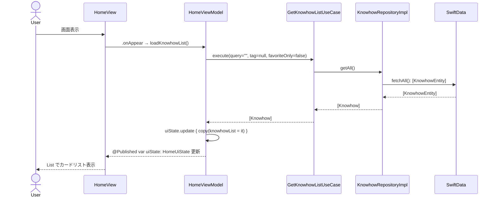
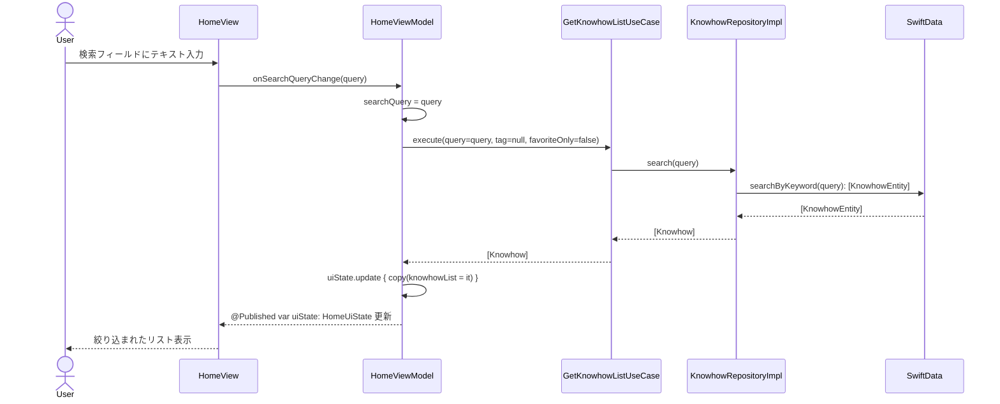
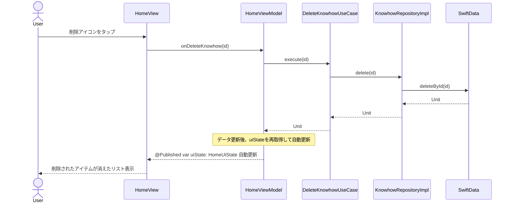

# 設計シーケンス図 - ホーム画面

ホーム画面の実装クラス名・メソッド名を使ったシーケンス図。

## ノウハウ一覧表示

```mermaid
sequenceDiagram
    actor User
    participant HomeView
    participant HomeViewModel
    participant GetKnowhowListUseCase
    participant KnowhowRepositoryImpl
    participant SwiftData

    User->>HomeView: 画面表示
    HomeView->>HomeViewModel: .onAppear → loadKnowhowList()
    HomeViewModel->>GetKnowhowListUseCase: execute(query="", tag=null, favoriteOnly=false)
    GetKnowhowListUseCase->>KnowhowRepositoryImpl: getAll()
    KnowhowRepositoryImpl->>SwiftData: fetchAll(): [KnowhowEntity]
    SwiftData-->>KnowhowRepositoryImpl: [KnowhowEntity]
    KnowhowRepositoryImpl-->>GetKnowhowListUseCase: [Knowhow]
    GetKnowhowListUseCase-->>HomeViewModel: [Knowhow]
    HomeViewModel->>HomeViewModel: uiState.update { copy(knowhowList = it) }
    HomeViewModel-->>HomeView: @Published var uiState: HomeUiState 更新
    HomeView-->>User: List でカードリスト表示
```

## キーワード検索

```mermaid
sequenceDiagram
    actor User
    participant HomeView
    participant HomeViewModel
    participant GetKnowhowListUseCase
    participant KnowhowRepositoryImpl
    participant SwiftData

    User->>HomeView: 検索フィールドにテキスト入力
    HomeView->>HomeViewModel: onSearchQueryChange(query)
    HomeViewModel->>HomeViewModel: searchQuery = query
    HomeViewModel->>GetKnowhowListUseCase: execute(query=query, tag=null, favoriteOnly=false)
    GetKnowhowListUseCase->>KnowhowRepositoryImpl: search(query)
    KnowhowRepositoryImpl->>SwiftData: searchByKeyword(query): [KnowhowEntity]
    SwiftData-->>KnowhowRepositoryImpl: [KnowhowEntity]
    KnowhowRepositoryImpl-->>GetKnowhowListUseCase: [Knowhow]
    GetKnowhowListUseCase-->>HomeViewModel: [Knowhow]
    HomeViewModel->>HomeViewModel: uiState.update { copy(knowhowList = it) }
    HomeViewModel-->>HomeView: @Published var uiState: HomeUiState 更新
    HomeView-->>User: 絞り込まれたリスト表示
```

## ノウハウ削除

```mermaid
sequenceDiagram
    actor User
    participant HomeView
    participant HomeViewModel
    participant DeleteKnowhowUseCase
    participant KnowhowRepositoryImpl
    participant SwiftData

    User->>HomeView: 削除アイコンをタップ
    HomeView->>HomeViewModel: onDeleteKnowhow(id)
    HomeViewModel->>DeleteKnowhowUseCase: execute(id)
    DeleteKnowhowUseCase->>KnowhowRepositoryImpl: delete(id)
    KnowhowRepositoryImpl->>SwiftData: deleteById(id)
    SwiftData-->>KnowhowRepositoryImpl: Unit
    KnowhowRepositoryImpl-->>DeleteKnowhowUseCase: Unit
    DeleteKnowhowUseCase-->>HomeViewModel: Unit
    Note over HomeViewModel: データ更新後、uiStateを再取得して自動更新
    HomeViewModel-->>HomeView: @Published var uiState: HomeUiState 自動更新
    HomeView-->>User: 削除されたアイテムが消えたリスト表示
```
