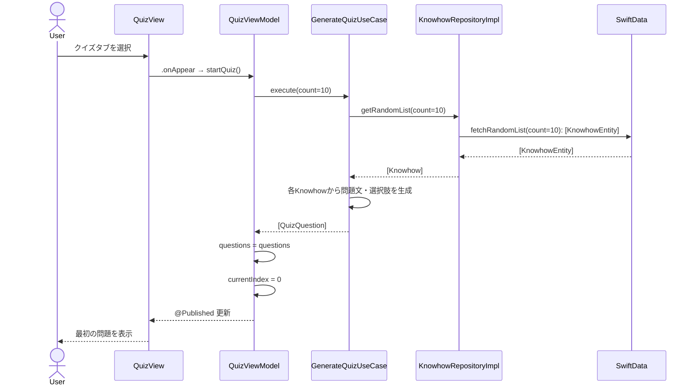
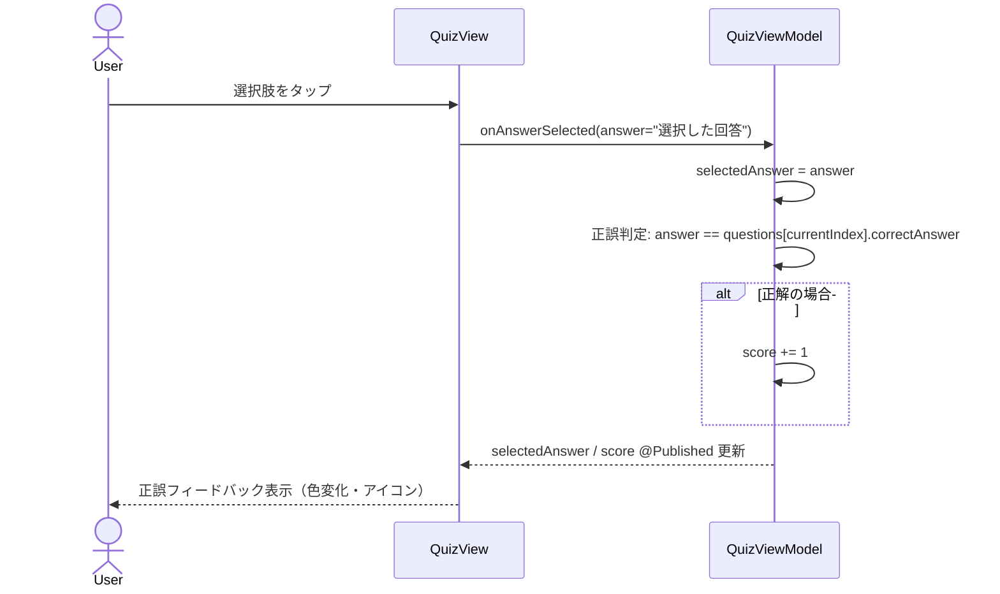
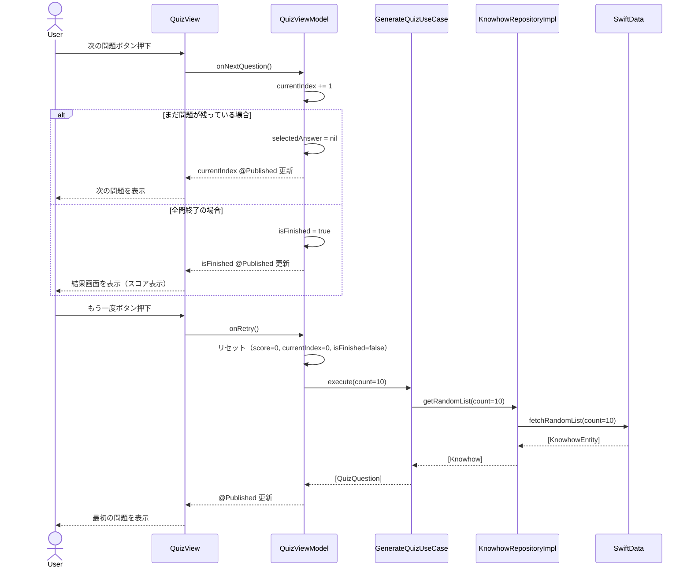

# 設計シーケンス図 - クイズ画面

クイズ画面の実装クラス名・メソッド名を使ったシーケンス図。

## クイズ開始・問題生成

```mermaid
sequenceDiagram
    actor User
    participant QuizView
    participant QuizViewModel
    participant GenerateQuizUseCase
    participant KnowhowRepositoryImpl
    participant SwiftData

    User->>QuizView: クイズタブを選択
    QuizView->>QuizViewModel: .onAppear → startQuiz()
    QuizViewModel->>GenerateQuizUseCase: execute(count=10)
    GenerateQuizUseCase->>KnowhowRepositoryImpl: getRandomList(count=10)
    KnowhowRepositoryImpl->>SwiftData: fetchRandomList(count=10): [KnowhowEntity]
    SwiftData-->>KnowhowRepositoryImpl: [KnowhowEntity]
    KnowhowRepositoryImpl-->>GenerateQuizUseCase: [Knowhow]
    GenerateQuizUseCase->>GenerateQuizUseCase: 各Knowhowから問題文・選択肢を生成
    GenerateQuizUseCase-->>QuizViewModel: [QuizQuestion]
    QuizViewModel->>QuizViewModel: questions = questions
    QuizViewModel->>QuizViewModel: currentIndex = 0
    QuizViewModel-->>QuizView: @Published 更新
    QuizView-->>User: 最初の問題を表示
```

## 回答・正誤判定

```mermaid
sequenceDiagram
    actor User
    participant QuizView
    participant QuizViewModel

    User->>QuizView: 選択肢をタップ
    QuizView->>QuizViewModel: onAnswerSelected(answer="選択した回答")
    QuizViewModel->>QuizViewModel: selectedAnswer = answer
    QuizViewModel->>QuizViewModel: 正誤判定: answer == questions[currentIndex].correctAnswer
    alt 正解の場合
        QuizViewModel->>QuizViewModel: score += 1
    end
    QuizViewModel-->>QuizView: selectedAnswer / score @Published 更新
    QuizView-->>User: 正誤フィードバック表示（色変化・アイコン）
```

## 次の問題へ進む・終了

```mermaid
sequenceDiagram
    actor User
    participant QuizView
    participant QuizViewModel
    participant GenerateQuizUseCase
    participant KnowhowRepositoryImpl
    participant SwiftData

    User->>QuizView: 次の問題ボタン押下
    QuizView->>QuizViewModel: onNextQuestion()
    QuizViewModel->>QuizViewModel: currentIndex += 1
    alt まだ問題が残っている場合
        QuizViewModel->>QuizViewModel: selectedAnswer = nil
        QuizViewModel-->>QuizView: currentIndex @Published 更新
        QuizView-->>User: 次の問題を表示
    else 全問終了の場合
        QuizViewModel->>QuizViewModel: isFinished = true
        QuizViewModel-->>QuizView: isFinished @Published 更新
        QuizView-->>User: 結果画面を表示（スコア表示）
    end
    User->>QuizView: もう一度ボタン押下
    QuizView->>QuizViewModel: onRetry()
    QuizViewModel->>QuizViewModel: リセット（score=0, currentIndex=0, isFinished=false）
    QuizViewModel->>GenerateQuizUseCase: execute(count=10)
    GenerateQuizUseCase->>KnowhowRepositoryImpl: getRandomList(count=10)
    KnowhowRepositoryImpl->>SwiftData: fetchRandomList(count=10)
    SwiftData-->>KnowhowRepositoryImpl: [KnowhowEntity]
    KnowhowRepositoryImpl-->>GenerateQuizUseCase: [Knowhow]
    GenerateQuizUseCase-->>QuizViewModel: [QuizQuestion]
    QuizViewModel-->>QuizView: @Published 更新
    QuizView-->>User: 最初の問題を表示
```
