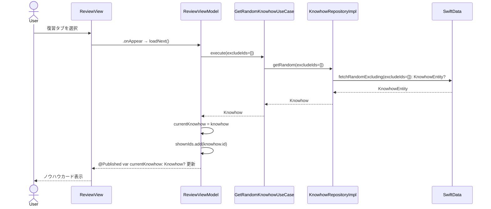
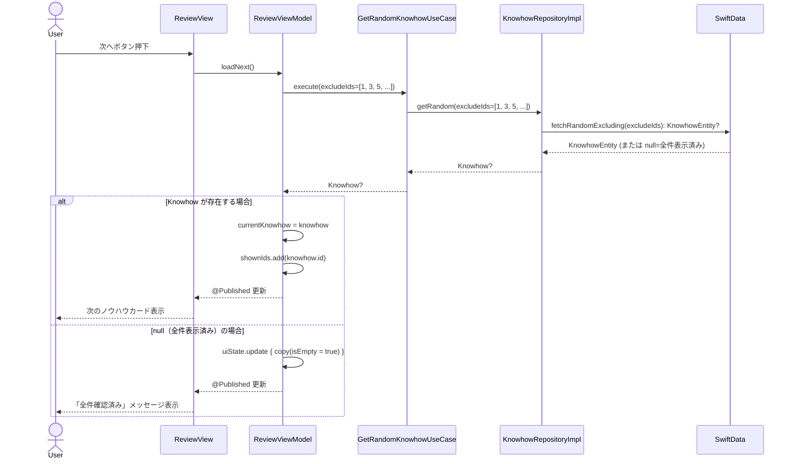
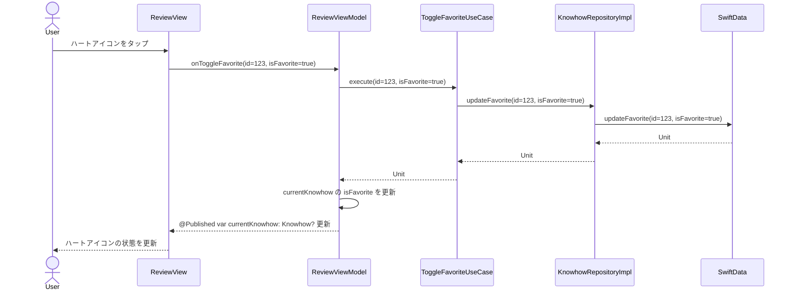

# 設計シーケンス図 - 復習画面

復習画面の実装クラス名・メソッド名を使ったシーケンス図。

## ランダム復習表示

```mermaid
sequenceDiagram
    actor User
    participant ReviewView
    participant ReviewViewModel
    participant GetRandomKnowhowUseCase
    participant KnowhowRepositoryImpl
    participant SwiftData

    User->>ReviewView: 復習タブを選択
    ReviewView->>ReviewViewModel: .onAppear → loadNext()
    ReviewViewModel->>GetRandomKnowhowUseCase: execute(excludeIds=[])
    GetRandomKnowhowUseCase->>KnowhowRepositoryImpl: getRandom(excludeIds=[])
    KnowhowRepositoryImpl->>SwiftData: fetchRandomExcluding(excludeIds=[]): KnowhowEntity?
    SwiftData-->>KnowhowRepositoryImpl: KnowhowEntity
    KnowhowRepositoryImpl-->>GetRandomKnowhowUseCase: Knowhow
    GetRandomKnowhowUseCase-->>ReviewViewModel: Knowhow
    ReviewViewModel->>ReviewViewModel: currentKnowhow = knowhow
    ReviewViewModel->>ReviewViewModel: shownIds.add(knowhow.id)
    ReviewViewModel-->>ReviewView: @Published var currentKnowhow: Knowhow? 更新
    ReviewView-->>User: ノウハウカード表示
```

## 次のノウハウへ進む

```mermaid
sequenceDiagram
    actor User
    participant ReviewView
    participant ReviewViewModel
    participant GetRandomKnowhowUseCase
    participant KnowhowRepositoryImpl
    participant SwiftData

    User->>ReviewView: 次へボタン押下
    ReviewView->>ReviewViewModel: loadNext()
    ReviewViewModel->>GetRandomKnowhowUseCase: execute(excludeIds=[1, 3, 5, ...])
    GetRandomKnowhowUseCase->>KnowhowRepositoryImpl: getRandom(excludeIds=[1, 3, 5, ...])
    KnowhowRepositoryImpl->>SwiftData: fetchRandomExcluding(excludeIds): KnowhowEntity?
    SwiftData-->>KnowhowRepositoryImpl: KnowhowEntity (または null=全件表示済み)
    KnowhowRepositoryImpl-->>GetRandomKnowhowUseCase: Knowhow?
    GetRandomKnowhowUseCase-->>ReviewViewModel: Knowhow?
    alt Knowhow が存在する場合
        ReviewViewModel->>ReviewViewModel: currentKnowhow = knowhow
        ReviewViewModel->>ReviewViewModel: shownIds.add(knowhow.id)
        ReviewViewModel-->>ReviewView: @Published 更新
        ReviewView-->>User: 次のノウハウカード表示
    else null（全件表示済み）の場合
        ReviewViewModel->>ReviewViewModel: uiState.update { copy(isEmpty = true) }
        ReviewViewModel-->>ReviewView: @Published 更新
        ReviewView-->>User: 「全件確認済み」メッセージ表示
    end
```

## お気に入り切り替え

```mermaid
sequenceDiagram
    actor User
    participant ReviewView
    participant ReviewViewModel
    participant ToggleFavoriteUseCase
    participant KnowhowRepositoryImpl
    participant SwiftData

    User->>ReviewView: ハートアイコンをタップ
    ReviewView->>ReviewViewModel: onToggleFavorite(id=123, isFavorite=true)
    ReviewViewModel->>ToggleFavoriteUseCase: execute(id=123, isFavorite=true)
    ToggleFavoriteUseCase->>KnowhowRepositoryImpl: updateFavorite(id=123, isFavorite=true)
    KnowhowRepositoryImpl->>SwiftData: updateFavorite(id=123, isFavorite=true)
    SwiftData-->>KnowhowRepositoryImpl: Unit
    KnowhowRepositoryImpl-->>ToggleFavoriteUseCase: Unit
    ToggleFavoriteUseCase-->>ReviewViewModel: Unit
    ReviewViewModel->>ReviewViewModel: currentKnowhow の isFavorite を更新
    ReviewViewModel-->>ReviewView: @Published var currentKnowhow: Knowhow? 更新
    ReviewView-->>User: ハートアイコンの状態を更新
```
