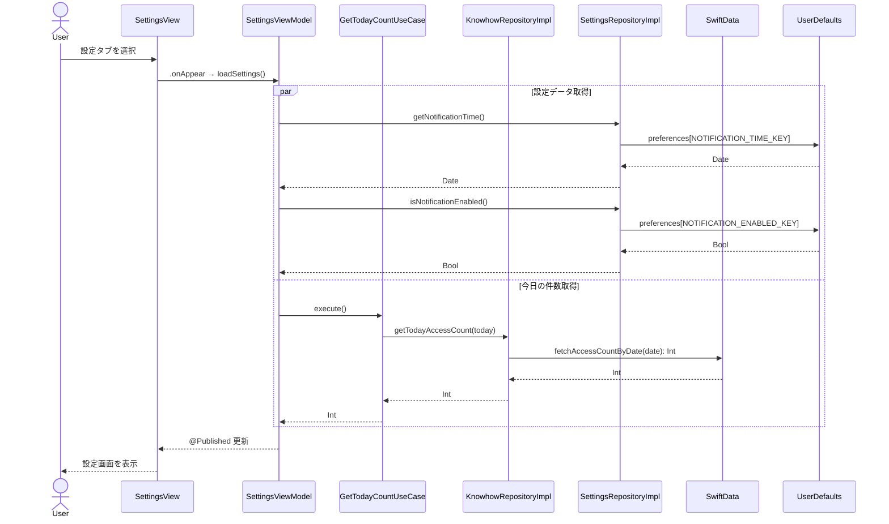
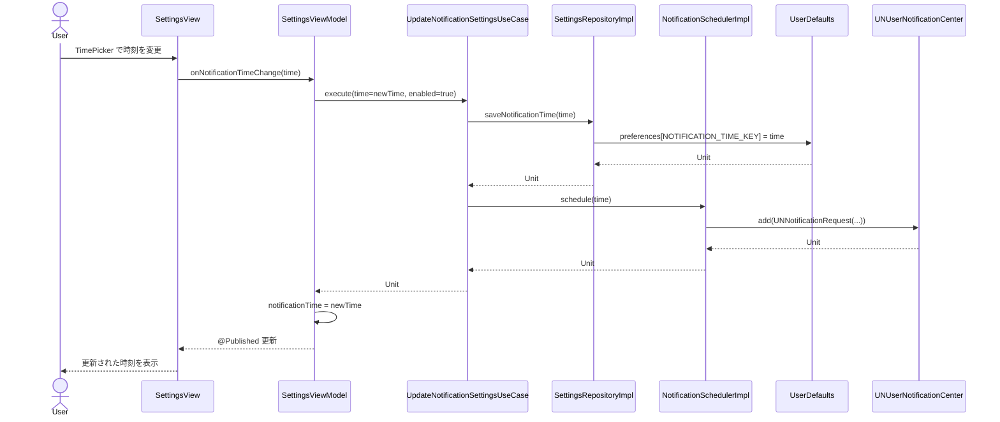
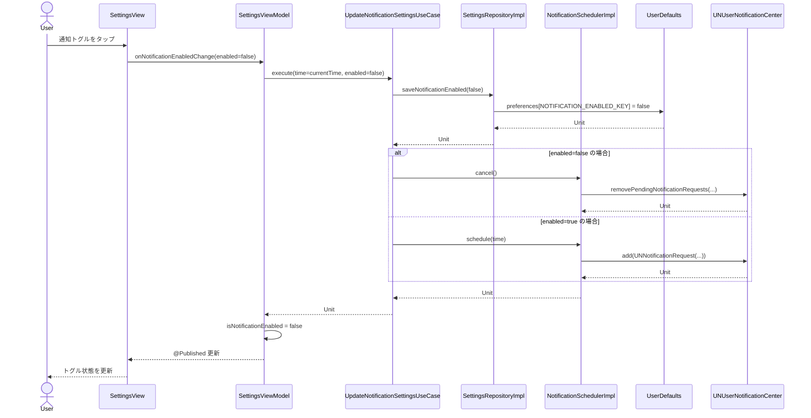

# 設計シーケンス図 - 設定画面

設定画面の実装クラス名・メソッド名を使ったシーケンス図。

## 設定画面表示

```mermaid
sequenceDiagram
    actor User
    participant SettingsView
    participant SettingsViewModel
    participant GetTodayCountUseCase
    participant KnowhowRepositoryImpl
    participant SettingsRepositoryImpl
    participant SwiftData
    participant UserDefaults

    User->>SettingsView: 設定タブを選択
    SettingsView->>SettingsViewModel: .onAppear → loadSettings()
    par 設定データ取得
        SettingsViewModel->>SettingsRepositoryImpl: getNotificationTime()
        SettingsRepositoryImpl->>UserDefaults: preferences[NOTIFICATION_TIME_KEY]
        UserDefaults-->>SettingsRepositoryImpl: Date
        SettingsRepositoryImpl-->>SettingsViewModel: Date
        SettingsViewModel->>SettingsRepositoryImpl: isNotificationEnabled()
        SettingsRepositoryImpl->>UserDefaults: preferences[NOTIFICATION_ENABLED_KEY]
        UserDefaults-->>SettingsRepositoryImpl: Bool
        SettingsRepositoryImpl-->>SettingsViewModel: Bool
    and 今日の件数取得
        SettingsViewModel->>GetTodayCountUseCase: execute()
        GetTodayCountUseCase->>KnowhowRepositoryImpl: getTodayAccessCount(today)
        KnowhowRepositoryImpl->>SwiftData: fetchAccessCountByDate(date): Int
        SwiftData-->>KnowhowRepositoryImpl: Int
        KnowhowRepositoryImpl-->>GetTodayCountUseCase: Int
        GetTodayCountUseCase-->>SettingsViewModel: Int
    end
    SettingsViewModel-->>SettingsView: @Published 更新
    SettingsView-->>User: 設定画面を表示
```

## 通知時刻変更

```mermaid
sequenceDiagram
    actor User
    participant SettingsView
    participant SettingsViewModel
    participant UpdateNotificationSettingsUseCase
    participant SettingsRepositoryImpl
    participant NotificationSchedulerImpl
    participant UserDefaults
    participant UNUserNotificationCenter

    User->>SettingsView: TimePicker で時刻を変更
    SettingsView->>SettingsViewModel: onNotificationTimeChange(time)
    SettingsViewModel->>UpdateNotificationSettingsUseCase: execute(time=newTime, enabled=true)
    UpdateNotificationSettingsUseCase->>SettingsRepositoryImpl: saveNotificationTime(time)
    SettingsRepositoryImpl->>UserDefaults: preferences[NOTIFICATION_TIME_KEY] = time
    UserDefaults-->>SettingsRepositoryImpl: Unit
    SettingsRepositoryImpl-->>UpdateNotificationSettingsUseCase: Unit
    UpdateNotificationSettingsUseCase->>NotificationSchedulerImpl: schedule(time)
    NotificationSchedulerImpl->>UNUserNotificationCenter: add(UNNotificationRequest(...))
    UNUserNotificationCenter-->>NotificationSchedulerImpl: Unit
    NotificationSchedulerImpl-->>UpdateNotificationSettingsUseCase: Unit
    UpdateNotificationSettingsUseCase-->>SettingsViewModel: Unit
    SettingsViewModel->>SettingsViewModel: notificationTime = newTime
    SettingsViewModel-->>SettingsView: @Published 更新
    SettingsView-->>User: 更新された時刻を表示
```

## 通知ON/OFF切り替え

```mermaid
sequenceDiagram
    actor User
    participant SettingsView
    participant SettingsViewModel
    participant UpdateNotificationSettingsUseCase
    participant SettingsRepositoryImpl
    participant NotificationSchedulerImpl
    participant UserDefaults
    participant UNUserNotificationCenter

    User->>SettingsView: 通知トグルをタップ
    SettingsView->>SettingsViewModel: onNotificationEnabledChange(enabled=false)
    SettingsViewModel->>UpdateNotificationSettingsUseCase: execute(time=currentTime, enabled=false)
    UpdateNotificationSettingsUseCase->>SettingsRepositoryImpl: saveNotificationEnabled(false)
    SettingsRepositoryImpl->>UserDefaults: preferences[NOTIFICATION_ENABLED_KEY] = false
    UserDefaults-->>SettingsRepositoryImpl: Unit
    SettingsRepositoryImpl-->>UpdateNotificationSettingsUseCase: Unit
    alt enabled=false の場合
        UpdateNotificationSettingsUseCase->>NotificationSchedulerImpl: cancel()
        NotificationSchedulerImpl->>UNUserNotificationCenter: removePendingNotificationRequests(...)
        UNUserNotificationCenter-->>NotificationSchedulerImpl: Unit
    else enabled=true の場合
        UpdateNotificationSettingsUseCase->>NotificationSchedulerImpl: schedule(time)
        NotificationSchedulerImpl->>UNUserNotificationCenter: add(UNNotificationRequest(...))
        UNUserNotificationCenter-->>NotificationSchedulerImpl: Unit
    end
    NotificationSchedulerImpl-->>UpdateNotificationSettingsUseCase: Unit
    UpdateNotificationSettingsUseCase-->>SettingsViewModel: Unit
    SettingsViewModel->>SettingsViewModel: isNotificationEnabled = false
    SettingsViewModel-->>SettingsView: @Published 更新
    SettingsView-->>User: トグル状態を更新
```
